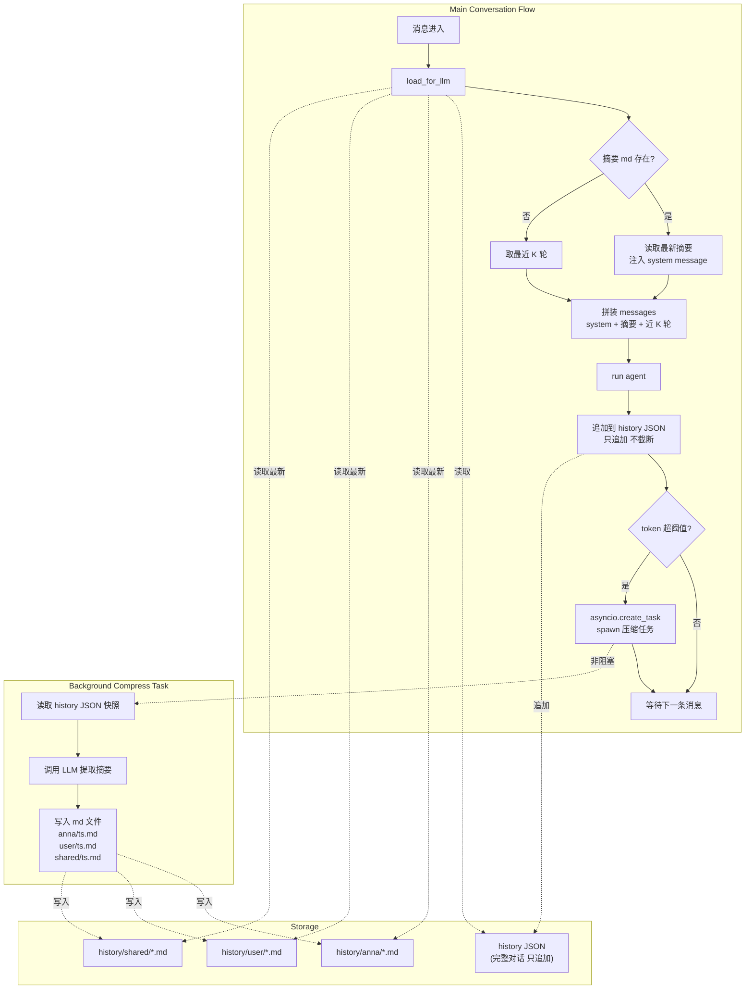
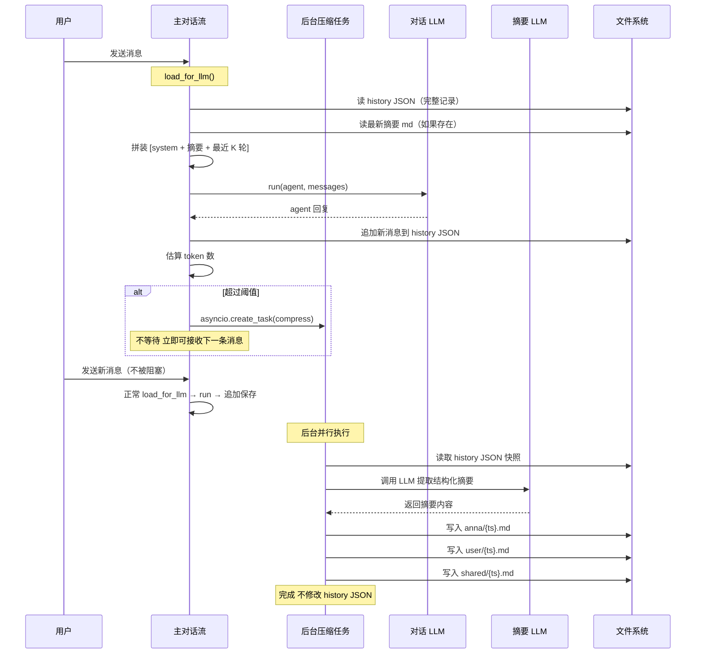

# 记忆压缩系统设计

## 设计目标

- 对话历史永久保留，只追加不删除
- 通过 LLM 摘要压缩长期记忆，控制送入模型的 token 数
- 压缩任务完全异步，不阻塞主对话流
- 无 session 概念，单用户持久化陪伴场景

## 存储结构

```
history/
  wechat/{user_id}.json    # 微信对话完整记录（只追加）
  cli.json                  # CLI 对话完整记录（只追加）
  anna/
    {timestamp}.md          # Anna 侧记忆快照
  user/
    {timestamp}.md          # 用户侧记忆快照
  shared/
    {timestamp}.md          # 关系侧记忆（话题脉络、未完结话题）
```

- history JSON 是永久存档，只追加不截断
- 摘要 md 按时间戳累积，三个文件夹同一时间戳一组

## 摘要维度

```yaml
# 用户侧 (user/{ts}.md)
user_facts:        # 事实信息：姓名、职业、提到的人/事
user_state:        # 当前状态：情绪、在做什么、聊天意愿
user_preferences:  # 偏好：喜好、习惯、雷区（不想聊的话题）

# Anna 侧 (anna/{ts}.md)
anna_stance:       # Anna 当前对用户的态度/语气基调
anna_commitments:  # Anna 做出的承诺或约定

# 关系侧 (shared/{ts}.md)
topic_thread:      # 话题脉络：聊了什么，当前话题走向
open_threads:      # 未完结的话题/悬而未决的事
```

## Token 计算

粗算策略，不引入额外依赖：

```python
token_estimate = len(json.dumps(messages)) / 3
```

中英混合场景下约 3 字符 ≈ 1 token，足够触发压缩判断。

## 架构设计图



### 核心要点

- **history JSON 只追加不删除**：永久保留用户完整对话记录
- **摘要 md 与 history JSON 完全解耦**：压缩任务只写 md，主流程只追加 JSON，互不干扰
- **无需加锁**：两个流程操作不同文件，不存在竞态

## 时序图



## LLM 消息拼装逻辑

```python
def load_for_llm(user_id: str) -> list[dict]:
    """从完整历史 + 摘要 md 组装送给 LLM 的 messages。"""
    full_history = load_history(user_id)        # 完整对话记录
    summary = load_latest_summary()             # 最新摘要 md（三个维度合并）
    recent = full_history[-K:]                   # 最近 K 轮

    messages = []
    if summary:
        messages.append({"role": "system", "content": summary})
    messages.extend(recent)
    return messages
```

## 摘要累积策略

- 每次压缩生成一组新的 `{timestamp}.md`，按时间顺序累积
- `load_latest_summary()` 只读取最新一组
- 当摘要文件本身过多时，可触发"摘要的摘要"：合并多条摘要为一条
  - `user_facts` 和 `user_preferences`：merge 合并（长期有效）
  - `user_state` 和 `open_threads`：只保留最新（时效性强）
  - `anna_stance` 和 `anna_commitments`：保留最新 + 未兑现的承诺
